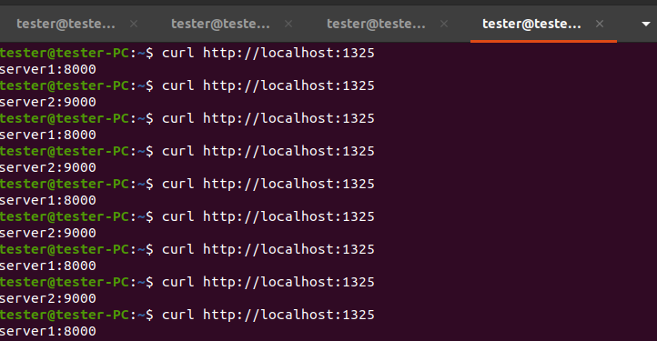
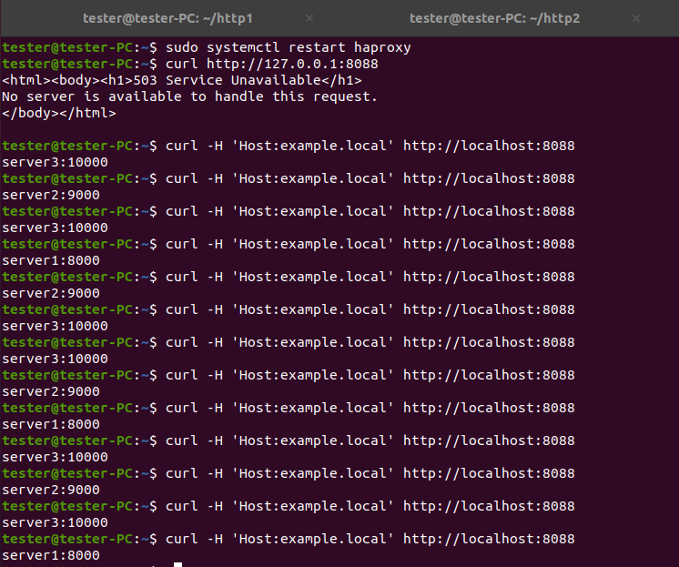

# Домашнее задание к занятию «`Кластеризация и балансировка нагрузки`» - `Коряко Виталий`

https://github.com/netology-code/sflt-homeworks/blob/main/2.md

https://www.dmosk.ru/miniinstruktions.php?mini=haproxy-centos7

### Цель задания
В результате выполнения этого задания вы научитесь:
1. Настраивать балансировку с помощью HAProxy
2. Настраивать связку HAProxy + Nginx

---

### Задание 1
- Запустите два simple python сервера на своей виртуальной машине на разных портах
- Установите и настройте HAProxy, воспользуйтесь материалами к лекции по ссылке
- Настройте балансировку Round-robin на 4 уровне.
- На проверку направьте конфигурационный файл haproxy, скриншоты, где видно перенаправление запросов на разные серверы при обращении к HAProxy.

### Решение 1

```
cd ~
mkdir http1
mkdir http2
echo "server1:8000" > http1/index.html
echo "server2:9000" > http2/index.html
# run servers in their dirs -> python3 -m http.server <port>

sudo apt install haproxy
nano /etc/haproxy/haproxy.cfg
# add
listen web_tcp
        bind :1325
        balance roundrobin
        server s1 127.0.0.1:8000 check inter 3s
        server s2 127.0.0.1:9000 check inter 3s

# reload and test
sudo systemctl reload haproxy

curl http://localhost:1325
```

[tcp_balancer_cfg](./haproxy_tcp.cfg)



---

### Задание 2
- Запустите три simple python сервера на своей виртуальной машине на разных портах
- Настройте балансировку Weighted Round Robin на 7 уровне, чтобы первый сервер имел вес 2, второй - 3, а третий - 4
- HAproxy должен балансировать только тот http-трафик, который адресован домену example.local
- На проверку направьте конфигурационный файл haproxy, скриншоты, где видно перенаправление запросов на разные серверы при обращении к HAProxy c использованием домена example.local и без него.

### Решение 2

```
cd ~
mkdir http1
mkdir http2
mkdir http3
echo "server1:8000" > http1/index.html
echo "server2:9000" > http2/index.html
echo "server3:10000" > http3/index.html
# run servers in their dirs -> python3 -m http.server <port>

sudo apt install haproxy
nano /etc/haproxy/haproxy.cfg
# add
frontend example
    bind :8088
    acl ACL_example.local hdr(host) -i example.local
    use_backend web_servers if ACL_example.local # proxy if host is examle.local

backend web_servers # roundrobin weighted on 7 level
    balance roundrobin
    server s1 127.0.0.1:8000 weight 2 check
    server s2 127.0.0.1:9000 weight 3 check
    server s3 127.0.0.1:10000 weight 4 check

# reload and test
sudo systemctl reload haproxy

# not working
curl http://localhost:8088

# working
curl -H 'Host:example.local' http://localhost:8088

```
[http_balancer_cfg](./haproxy_http.cfg)



---

## Задания со звёздочкой*
Эти задания дополнительные. Их можно не выполнять. На зачёт это не повлияет. Вы можете их выполнить, если хотите глубже разобраться в материале.

---

### Задание 3*
- Настройте связку HAProxy + Nginx как было показано на лекции.
- Настройте Nginx так, чтобы файлы .jpg выдавались самим Nginx (предварительно разместите несколько тестовых картинок в директории /var/www/), а остальные запросы переадресовывались на HAProxy, который в свою очередь переадресовывал их на два Simple Python server.
- На проверку направьте конфигурационные файлы nginx, HAProxy, скриншоты с запросами jpg картинок и других файлов на Simple Python Server, демонстрирующие корректную настройку.

---

### Задание 4*
- Запустите 4 simple python сервера на разных портах.
- Первые два сервера будут выдавать страницу index.html вашего сайта example1.local (в файле index.html напишите example1.local)
- Вторые два сервера будут выдавать страницу index.html вашего сайта example2.local (в файле index.html напишите example2.local)
- Настройте два бэкенда HAProxy
- Настройте фронтенд HAProxy так, чтобы в зависимости от запрашиваемого сайта example1.local или example2.local запросы перенаправлялись на разные бэкенды HAProxy
- На проверку направьте конфигурационный файл HAProxy, скриншоты, демонстрирующие запросы к разным фронтендам и ответам от разных бэкендов.

------